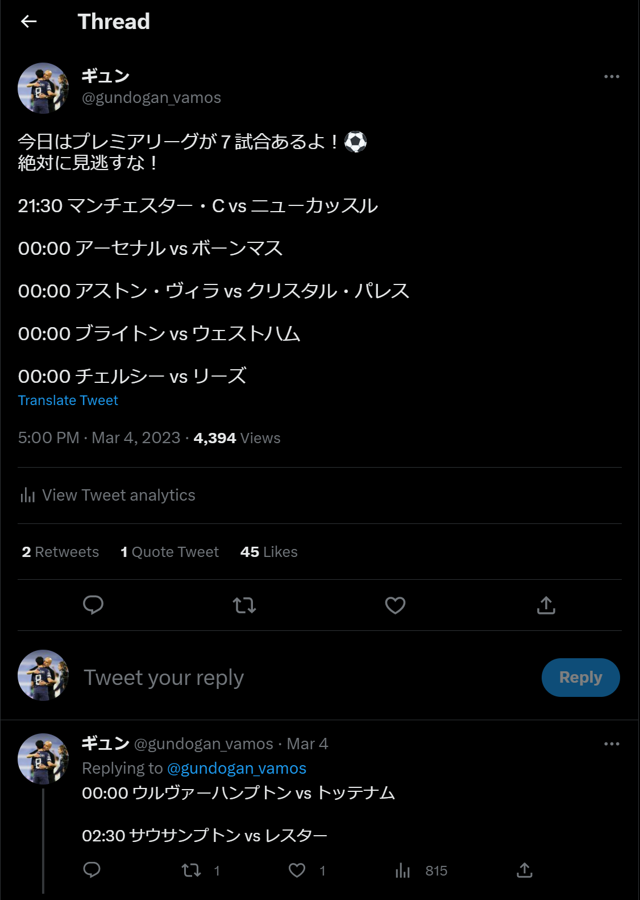

# FotBot
欧州サッカー情報を配信するTwitter botです

# ソースの説明
- matchday.ipynb
  - プレミアリーグ(EPL)で注目しているクラブの試合日程と対戦相手をTwitter botで配信します
  - 本番用リソースはAWS lambdaで管理しています
  - 毎日00:00に作動します



- expire.ipynb
  - プレミアリーグ(EPL)所属選手の契約期間と年棒をbotでTwitter botで配信します
  - 20クラブのうち1クラブをランダムに選択します
  - 本番用リソースはAWS lambdaで管理しています
  - 毎週金曜日17:00に作動します


# 起動
```
jupyter-notebook
```